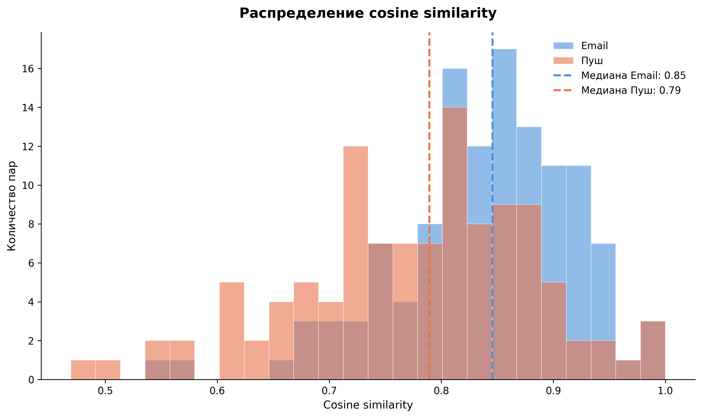
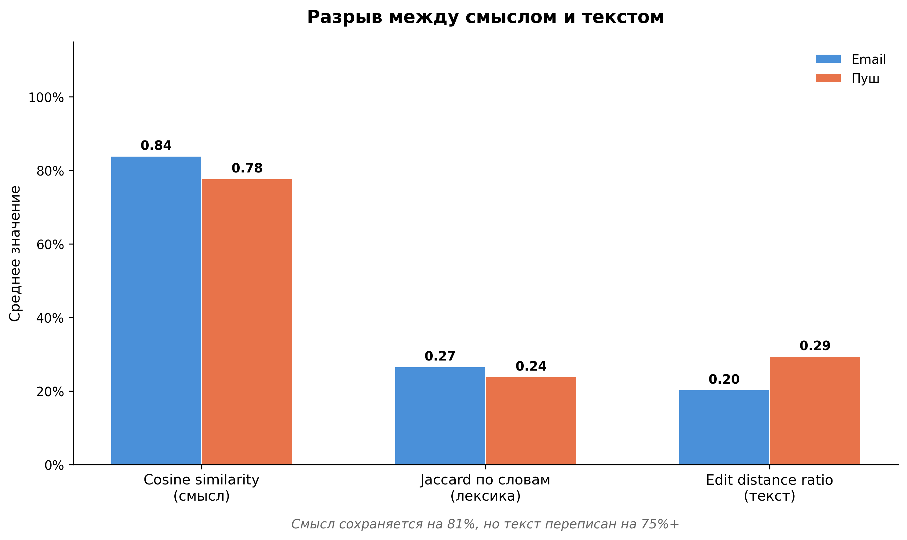
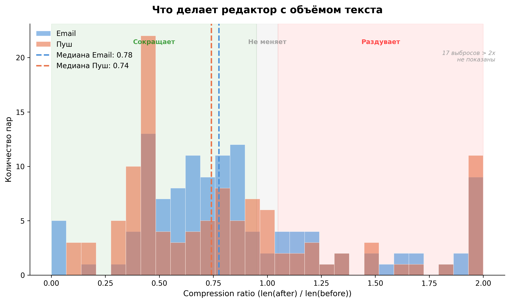
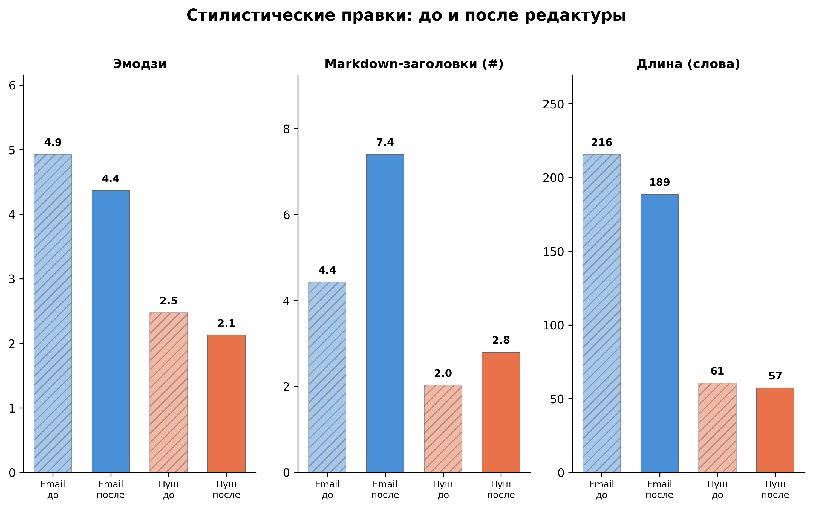

# Что остаётся от текста LLM после редактора: количественный анализ 234 пар «до/после»

Есть предположение, что LLM умеют писать тексты. Некоторые команды уже используют их для генерации рассылок, уведомлений, описаний товаров. Но вопрос «насколько это хорошо?» обычно решается на уровне ощущений: кто-то прочитал, ему «нормально» или «не то». Мы захотели подойти иначе — измерить, насколько тексты от LLM готовы к публикации без участия человека.

Для этого решили посчитать cosine similarity, edit distance, Jaccard, compression ratio. Взяли 234 пары реальных маркетинговых текстов — черновик от модели и финальную версию после редактора — и посчитали, что именно редактор меняет, в каком объёме и по каким паттернам.

Спойлер: смысл модель угадывает на 80-85%. Но переписывает редактор около 75-80% текста. Между «понял задачу» и «готово к публикации» — пропасть, и она измерима.

## Как устроен пайплайн генерации

Прежде чем перейти к результатам, важный контекст: тексты в нашем случае генерируются не «промптом в ChatGPT». За генерацией стоит production-grade пайплайн из 10 шагов: структурирование задачи, сжатие источников, подбор релевантных примеров из базы ~2400 штук (weighted scoring + LLM-reranking), параллельная генерация трёх вариантов, валидация лимитов, автоматическое сокращение и доставка.

Генерацию направляет подробная редполитика — около 1200 слов, 7 разделов: стиль и тон коммуникации, лимиты по символам для каждого поля, типографические правила, список запретов. Это не абстрактное «пиши хорошо», а конкретные инструкции вроде ограничений длины заголовка, запрета на определённые конструкции и требований к пунктуации.

Зачем это знать? Потому что результаты ниже — это не про наивную генерацию. Это про систему, в которой уже есть примеры, инструкции, multi-step обработка и автоматическая валидация. И всё равно — редактор переписывает 75-80% текста.

## Что мы анализировали

У нас есть процесс: LLM генерирует маркетинговые уведомления, затем редактор доводит их до публикации. Модель работает с подробным промптом — там и инструкции, и примеры, и ограничения по стилю. Но итоговый текст всё равно проходит через человека.

Мы собрали 234 пары текстов: **before** (сгенерированный LLM) и **after** (после редактора). Два канала:

- **Email-уведомления** — 122 штуки. Это более длинный формат, допускающий структуру с заголовками:
  - Заголовок (тема письма): до 28 символов
  - Подзаголовок (прехедер): до 80 символов, без точки в конце
  - Тело: без ограничений по длине
  - Кнопка: 1-3 слова
- **Push-уведомления** — 112 штук. Максимально лаконичный формат, каждое слово на счету:
  - Заголовок: до 20 символов (18 на текст + 2 на эмодзи)
  - Тело: до 110 символов

Вопрос, на который хотели ответить: *LLM даёт готовый текст или только черновик? И если черновик — на что именно редактор тратит время?*

## Методы: что и зачем мерили

Мы выбрали пять метрик, каждая отвечает на свой вопрос. Ни одна из них в отдельности не даёт полной картины, смысл именно в комбинации.

### Cosine similarity на эмбеддингах

**Что измеряет:** семантическую близость — говорят ли тексты об одном и том же.

**Как:** берём модель `paraphrase-multilingual-MiniLM-L12-v2` из `sentence-transformers`, получаем эмбеддинги для before и after, считаем косинусное сходство.

**Почему именно это:** единственный разумный способ оценить, сохраняется ли смысл при переписывании. Посимвольное сравнение тут бесполезно — «Скидка 30% на все товары» и «На весь ассортимент — минус 30%» семантически идентичны, но посимвольно разные.

**Результат:**

| Канал | Медиана | Среднее |
|-------|---------|---------|
| Email | 0.85    | ~0.84   |
| Пуш   | 0.79    | ~0.78   |

Смысл в целом сохраняется. Модель попадает в тему и задачу. Но разброс значительный — есть пары с cosine similarity ниже 0.5, где редактор фактически написал новый текст.

### Edit distance ratio

**Что измеряет:** посимвольное совпадение между before и after.

**Как:** `SequenceMatcher` из стандартной библиотеки `difflib`. Метод `.ratio()` возвращает долю совпадающих символов.

**Почему:** показывает реальный объём ручной работы. Если cosine говорит «смысл тот же», edit distance показывает, сколько текста пришлось перенабрать руками.

**Результат:**

| Канал | Медиана |
|-------|---------|
| Email | 0.16    |
| Пуш   | 0.27    |

Это ключевой момент: **совпадает только 16-27% символов**. Текст переписывается почти целиком. Сопоставьте с cosine similarity: смысл сохранён на 80-85%, но 75-85% текста — это другие слова, другие конструкции, другой ритм.

Этот разрыв — самая красноречивая находка анализа. Модель понимает *что* сказать, но не знает *как*.

### Jaccard similarity по словам и леммам

**Что измеряет:** какая доля лексики пережила редактуру.

**Как:** разбиваем тексты на слова, считаем пересечение множеств. Дополнительно прогоняем через лемматизатор `pymorphy3`, чтобы отделить реальные замены слов от морфологических — когда редактор просто меняет падеж или число.

**Почему:** cosine similarity работает на уровне семантики — он не отличает парафраз от сохранённой лексики. Jaccard показывает конкретнее: редактор использует словарь модели или подбирает свои слова.

**Результат:**

| Метрика | Email | Пуш |
|---------|----|------|
| Jaccard по словоформам | ~0.38 | ~0.32 |
| Jaccard по леммам | ~0.45 | ~0.38 |

Разница между словоформами и леммами — 20-25%. Это значит, что примерно четверть изменений — просто морфология: редактор берёт то же слово, но ставит в нужный падеж, число или время. Остальные 75% — реальные замены: другие слова для того же смысла.

**Survival rate лексики** (Jaccard по леммам): из словаря модели до финального текста доживает примерно 45% слов в письмах и 38% в пушах. Больше половины лексики заменяется.

### Compression ratio

**Что измеряет:** сокращает или удлиняет текст редактор.

**Как:** отношение `len(after) / len(before)`.

**Результат:** распределение бимодальное.

| Паттерн | Email | Пуш |
|---------|----|------|
| Сокращают | 70% (в среднем на 22%) | 68% (в среднем на 26%) |
| Раздувают | 27% | 23% |
| Не меняют | ~3% | ~9% |

Большинство текстов LLM — длиннее, чем нужно. Модель добавляет обороты, вводные, пояснения там, где достаточно одного предложения. Но есть и обратный случай: примерно в каждом четвёртом-пятом тексте редактор *дописывает* — когда модель не дала конкретных условий акции, шагов действия или дат.

Тексты, не требующие изменения длины, — редкость: 3-9%.

### Стилистический анализ

Помимо числовых метрик мы посчитали конкретные стилистические паттерны: эмодзи, markdown-разметку, пунктуацию.

**Эмодзи.** Редактор убирает эмодзи из 55-59% текстов. Модель злоупотребляет штампованным набором: подарки, ракеты, галочки, деньги, рост. Редактор либо убирает их совсем, либо заменяет на более уместные и менее избитые.

| Что делает модель | Что делает редактор |
|---|---|
| Повторяет одни и те же эмодзи (подарки, ракеты, галочки, деньги) | Убирает совсем или заменяет на более уместные |
| В среднем 5.4 эмодзи на письмо | В среднем 4.7 эмодзи на письмо |
| В среднем 2.8 эмодзи на пуш | В среднем 2.3 эмодзи на пуш |

**Структура.** Редактор добавляет markdown-заголовки: +67% в письмах, +37% в пушах. Модель недоструктурирует текст — пишет сплошным потоком там, где нужны визуальные разделители.

**Спорные конструкции в пушах.** Например, модель часто строит пуш как риторический вопрос в духе «Готовы начать?» или плохо согласовывает предложения. Редактор это чинит.

**Служебные элементы.** Редактор массово добавляет то, чего модель не знает: в основном связанное с продуктовыми механиками.

## Паттерны: что удаляют и что добавляют

Если посмотреть на уровень конкретных слов, картина складывается чёткая. Можно выделить два противоположных вектора правок.

**Удаляемые слова** — абстрактные обещания: *«поможет», «получите», «больше», «это», «или»*. Модель пишет рекламным языком — обещает, восхваляет, мотивирует. Редактор последовательно переводит это в утилитарный регистр: вместо эмоциональной накачки — конкретная польза.

**Добавляемые слова** — условия и инструкции: *«как», «если», «можно»*. Вместо безусловных обещаний появляются конструкции с оговорками: не «получите скидку», а «скидка действует, если...». Это не стилистический каприз редактора — это юридическая и продуктовая необходимость.

Этот сдвиг от «рекламного» к «утилитарному» — сквозной паттерн по всей выборке. Характер правок в числах:

| Тип правки | Доля |
|---|---|
| Реальная замена слов и смысла | ~75-80% |
| Морфологические правки (тот же корень, другая форма) | ~20-25% |

## Email vs пуш: разная глубина правок

Два канала ведут себя по-разному.

**Email-уведомления** — длиннее, со сложной структурой. Пространства для переписывания больше, и редактор им пользуется: текст меняется сильнее, но общий смысл остаётся. Cosine similarity выше (0.85), а edit distance ниже (0.16) — парадокс объясняется длиной: в длинном тексте можно переписать многое, не потеряв тему.

**Пуш-уведомления** — короткие, 1-2 предложения. Замена даже двух-трёх слов заметно сдвигает и смысл, и тон. Cosine similarity ниже (0.79), Jaccard ниже (0.38) — пуши требуют более точного попадания с первого раза, и именно здесь разрыв между черновиком и финалом максимальный.

Практический вывод: если оптимизировать промпты, начинать стоит с пушей. Там формат жёстче, ошибки виднее, а итерации быстрее за счёт короткого текста. Email-уведомления можно тюнить вторым этапом — там модель и так попадает в смысл, нужно подтягивать стиль и структуру.

## Что это значит

### Модель = хороший черновик по смыслу, слабый по форме

LLM корректно понимает задачу и выдает текст, семантически близкий к тому, что нужно. Но конкретные формулировки, стиль, структура и тон — все это редактор переделывает. Это не «вычитка», а полноценная переработка каждого второго слова.

### Редактор тратит время не на смысл, а на стилистику

Основная работа: подбор формулировок, сокращение, структурирование, расстановка UI-элементов, замена штампованных эмодзи, удаление риторических вопросов.

### Потери системные, а не случайные

Модель не всегда понимает tone of voice, не знает интерфейс продукта. Это не «иногда ошибается» — это воспроизводимые паттерны, с которыми надо работать.

Важно понимать: наш пайплайн уже включает ~2400 примеров, подробную редполитику, multi-step обработку с несколькими LLM. Это не вопрос «добавить что-то в промпт» — это системная задача, где каждое улучшение требует предметного анализа на реальных данных.

### Правильная метрика успеха

Не «процент текстов без правок» — при текущем качестве таких текстов почти нет. Правильная метрика — **экономия времени редактора**. Если LLM сокращает работу с 40 минут до 15 — это результат, даже при 80% переписанного текста. Модель берёт на себя разбор задачи, подбор структуры и первый драфт — это этап «от чистого листа до черновика», который дорого стоит по времени.

## Методологические оговорки

Честный анализ требует честного разговора об ограничениях.

**Одна модель, один домен.** Мы анализировали одну LLM на одном типе контента (маркетинговые уведомления) для одного продукта. Результаты нельзя экстраполировать на другие модели, другие форматы и другие предметные области. Возможно, на лонгридах или технических текстах картина была бы иной.

**Cosine similarity на коротких текстах.** Модель `paraphrase-multilingual-MiniLM-L12-v2` даёт эмбеддинги фиксированной размерности. На коротких текстах (пуши в 10-15 слов) семантическая близость может быть завышена: два предложения в одной тематике получают высокое сходство, даже если говорят о разном. Это частично объясняет, почему cosine similarity для пушей (0.79) не так сильно ниже писем (0.85), как можно было бы ожидать.

**Edit distance чувствителен к форматированию.** Если редактор добавил заголовок или переставил абзацы — edit distance покажет большие изменения, хотя содержательно текст мог измениться минимально. Мы не нормализовали тексты перед расчётом edit distance, чтобы показать реальный объём работы редактора, но стоит помнить, что часть «правок» — это форматирование, а не содержание.

**Лемматизация не идеальна.** `pymorphy3` хорошо работает на общелитературной лексике, но маркетинговые тексты содержат сленг, бренд-неймы, транслитерации. Часть расхождений в Jaccard по леммам может быть артефактом лемматизатора, а не реальной заменой слов.

**Субъективность редактуры.** Мы измеряем *что* менял редактор, а не *правильно ли* он менял. Часть правок может быть вкусовой. Без A/B-тестов на конверсию мы не можем сказать, что финальный текст объективно лучше черновика, — только что он отличается предсказуемым образом.

## Вместо заключения

LLM в текущем виде не автоматизирует написание текста. Она автоматизирует первый драфт. Это полезно — это экономит время на самом дорогом этапе: понимание задачи, сбор структуры, первая формулировка. Но между черновиком и публикацией остаётся значительный объём работы, который пока выполняет человек.

Хорошая новость: основные проблемы системные. Это не случайные галлюцинации или потеря смысла — это воспроизводимые стилистические и структурные паттерны, которые можно поэтапно закрывать через промпт-инжиниринг. Плохая новость: закрывать их придётся итеративно, по одному, на реальных данных — и это отдельный рабочий процесс, который требует инженерных ресурсов и обратной связи от редакторов.

Если вы встраиваете LLM в контентный пайплайн, вот три вещи, которые, по нашему опыту, дают наибольший эффект:

1. **Считайте не «процент готовых текстов», а «время редактора на доводку».** Первая метрика почти всегда будет близка к нулю. Вторая покажет реальную экономию.
2. **Инвестируйте в few-shot примеры.** Абстрактные инструкции в промпте работают хуже, чем 5-7 конкретных пар «задача -> эталонный текст». Модель учится стилю через примеры, а не через правила.
3. **Описывайте контекст интерфейса.** Модель не знает, что у уведомления есть кнопка, подвал, ограничение по длине заголовка. Эти знания не появятся сами — их нужно передать явно.

Наши данные: 234 пары, одна модель, один домен. Не истина в последней инстанции — но, надеемся, полезная точка отсчёта для тех, кто хочет понимать, где именно модель помогает, а где ещё нет.

---

*Стек: Python, sentence-transformers, pymorphy3, difflib, pandas, matplotlib*

*Теги: #nlp #llm #контент #аналитика #python*
